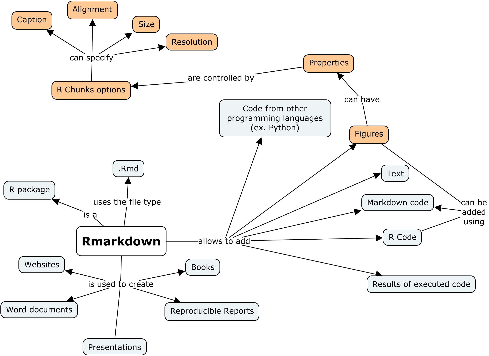

```{r setup, include=FALSE}
knitr::opts_chunk$set(echo = FALSE)
```

<!-- inicio font awesome -->
<script src="https://kit.fontawesome.com/1f72d6921a.js" crossorigin="anonymous"></script>
<!-- final font awesome -->


### 1.  Learner persona 

__General background:__ Maria is a PhD student in Social Sciences, and she was born and lives in São Paulo, Brasil. 
She enjoys spending time with her family and her dog called Zeus.

__Relevant experience:__ This is her first experience with R: Maria has been learning R at the university, in a discipline that teaches R for social sciences researchers.
In the undergrad and masters course, all her analysis were made using Excel.
In this discipline, the teacher already taught how to import data to R, how to manipulate data, create simple graphs, and the current content is how to make reproducible reports.  

__Their perceived needs:__ In the last week, she had the first class using R Markdown, and the teacher showed that she could do all the analysis in a reproducible way. She think this could be interesting to use in her research.
She wants to make reports for the analysis of her research, that could be updated when new data is available. 

__Special considerations:__ Maria does not have access to a good internet connection in her house, and sometimes she can't watch the live online classes.


### 2.  Concept map

```{r}

```

- Concept Map made with [<i class="fas fa-external-link-alt"></i> CMap Tools](https://cmap.ihmc.us/) 

### 3.  Formative Assessment 


```{r}
xaringanExtra::embed_xaringan(
  url = "https://beatriz-milz.shinyapps.io/formative_assessment/",
  ratio = "16:9"
)
```

<p style="text-align:right;">[<i class="fas fa-external-link-alt"></i> Open full page](https://beatriz-milz.shinyapps.io/formative_assessment/)</p>

### 4.  Slides 

```{r}
xaringanExtra::embed_xaringan(
  url = "https://beatrizmilz.github.io/RStudio_Certification/slides.html",
  ratio = "16:9"
)
```


<p style="text-align:right;">[<i class="fas fa-external-link-alt"></i> Open full page](https://beatrizmilz.github.io/RStudio_Certification/slides.html)</p>

