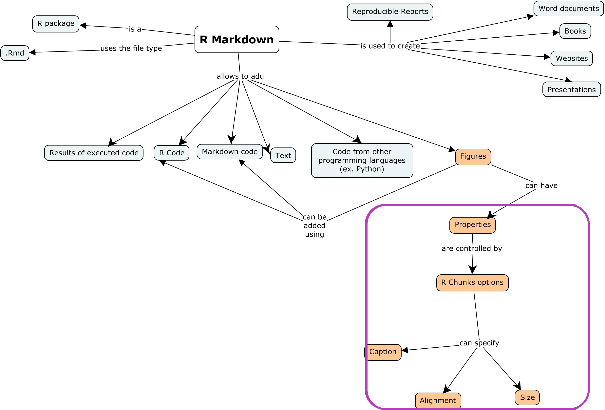

```{r setup, include=FALSE}
knitr::opts_chunk$set(echo = FALSE)
```

<!-- inicio font awesome -->
<script src="https://kit.fontawesome.com/1f72d6921a.js" crossorigin="anonymous"></script>
<!-- final font awesome -->


## About the class

This class is part of a discipline at the university that teaches R for social sciences graduate students.
In this discipline, the teacher already taught how to import data to R, how to manipulate data, create simple graphs, and the current content is how to make reproducible reports.  
In the last class, the teacher made an introduction about how to do the analysis in a reproducible way using R Markdown.
In this class, the students will learn how to add figures in the reports.

## 1.  Learner persona 

### A) Maria

__General background:__ Maria is a PhD student in Social Sciences, and she was born and lives in São Paulo, Brasil. 
She enjoys spending time with her family and her dog called Zeus.

__Relevant experience:__ This is her first experience with R.
In the undergrad and masters course, all her analysis were made using Excel.


__Perceived needs:__  She thinks that learning R Markdown could be helpfull to apply in her research.
She wants to make reports for the analysis of her research, that could be updated when new data is available. 

__Special considerations:__ Maria does not have access to a good internet connection in her house, and sometimes she can't watch the live online classes.


<!-- ### B) _____ -->

<!-- __General background:__  -->

<!-- __Relevant experience:__  -->

<!-- __Perceived needs:__   -->

<!-- __Special considerations:__  -->


## 2.  Concept map

```{r}

```

- [<i class="fas fa-external-link-alt"></i> View the image](img/concept_map2.png) 

- Concept Map made with [<i class="fas fa-external-link-alt"></i> CMap Tools](https://cmap.ihmc.us/) 

## 3.  Formative Assessment 


```{r}
xaringanExtra::embed_xaringan(
  url = "https://beatriz-milz.shinyapps.io/formative_assessment/",
  ratio = "3:2"
)
```

<p style="text-align:right;">[<i class="fas fa-external-link-alt"></i> Open full page](https://beatriz-milz.shinyapps.io/formative_assessment/)</p>

## 4.  Slides 

```{r}
xaringanExtra::embed_xaringan(
  url = "https://beatrizmilz.github.io/RStudio_Certification/slides.html",
  ratio = "16:9"
)
```


<p style="text-align:right;">[<i class="fas fa-external-link-alt"></i> Open full page](https://beatrizmilz.github.io/RStudio_Certification/slides.html)</p>

